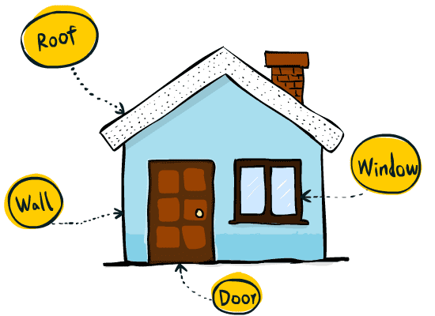

# [译] 组件、Props 和 State 

> 原文链接: [https://learnreact.design/2017/08/16/components-props-and-state](https://learnreact.design/2017/08/16/components-props-and-state)
>
> 喜欢理由: 文笔生动 通俗易懂

系列博客: 用通俗的语言和涂鸦来解释 React 术语

  * [图解 React](./What-Is-React.md)
  * [图解 React Native](./What-Is-React-Native.md)
  * 组件、Props 和 State (本文)
  * [Props 和 State 深入理解](https://learnreact.design/2018/01/15/props-and-state-re-explained) (待翻译)
  * [React Native vs. Cordova、PhoneGap、Ionic，等等](https://learnreact.design/2018/02/14/react-native-vs-cordova-phone-gap-ionic-etc) (待翻译)

今天我们来学习 React 里最重要的三个概念: 组件、props 和 state ，以及 props 和 state 之间的区别。

如同之前的文章，我还是会尝试用通俗的语言来解释这些概念。因此，阅读本文同样不需要任何 JavaScript 基础。

实际上，在本章中你根本找不到任何 JavaScript 代码。相反，在深入 JavaScript 代码(在后面的文章中)之前，我讲使用一种简单的形式来帮助你理解主要概念。我相信这种 🥄 填鸭式的方法对于学习 React (或任何技术) 都是有效的，尤其是当你没有太多编程经验时，要是将 React 的概念和 JavaScript 的细节混在一起的话，很可能会另你不知所措！

## 学习目标

当你读完本文后希望你能重新回到这里，并能够轻松出回答一下问题:

  * 什么是 prop ？
  * 什么是 state ？
  * 何时使用 props ？何时使用 state ？
  * 如何让窗户保持打开状态？
  * 你能写出 Domo 的帽子的伪代码吗？

## 盖房子

要想理解这些概念是什么以及如何使用它们，我们先来写一个小示例。就盖个房子如何？(点击门有惊喜)

查看由 focuser ([@focuser](https://codepen.io/focuser/)) 在 [CodePen](https://codepen.io/) 编写的 Demo : [React 小屋](https://codepen.io/focuser/pen/EXBOpx/)。

## 组件

如果你还记得我们在[前面文章](./What-Is-React.md)中所讨论过的，组件是 React 的三大支柱之一。使用 React 开发应用基本都是在使用组件。

第一步是将 UI 分解成多个组件。例如，我们可以这样来拆分房子:



现在来编码！

```jsx
House:

  <div>
    <Roof />     // 房顶
    <Wall />     // 墙
    <Window />   // 窗
    <Door />     // 门
  </div>
```

等一下，怎么看起来这么像 HTML ？没错！React 的部分代码看上去就是非常像 HTML ，其实就是这样设计的，为了让 Web 设计师理解和编写 React 代码更容易一些。太贴心了！

因此，在上面的代码中，我们使用 `<div>` 作为容器，这基本和 HTML 中是一样的。而像 `Roof` 和 `Wall` 这样的标签是我们即将定义的自定义标签/组件。

温馨提示: 上面的代码并非实际的 React 代码，甚至连 JavaScript 都算不上。暂时，我们只使用这种宽松的语法来介绍概念。一旦你理解这些概念后，我们再来学习 JavaScript 的细节并将上述概念转换成真实代码。

为了更好地理解，我将选用另外一种简化形式: 不再使用插图的形式，而是着手创建一个超级简单的 Web 应用，目前应用只会用文本来展示一切。

例如，`Roof` 其实就是一个里面有文字的 div :

```jsx
Roof:

  <div>roof</div>
```

其他组件也是如此，都是只有文字的 div 而已。首先，我们来看下房子的完整的 React 风格的代码:

```jsx
House:

  <div>
    <Roof />
    <Wall />
    <Window />
    <Door />
  </div>  

Roof:

  <div>roof</div>

Wall:

  <div>wall</div>

Window:

  <div>window</div>

Door:

  <div>door</div>
```

这没什么不好理解的，是吧？`House` 是由 `Roof`、`Wall`、`Window` 和 `Door` 组成的，这些都是纯文本构成的组件。

最后，React 生成的 HTML 如下所示:

```jsx
<div>
  <div>roof</div>
  <div>wall</div>
  <div>windows</div>
  <div>door</div>
</div>
```

## 使用 Props 来配置屋顶的颜色

想象一下，我们将规格说明书发给工厂，所有的零部件都是由该工厂代工的。在规格说明书中，我们可以告诉工厂每个部件的固有属性，比如屋顶的颜色、门的形状，等等。在按照我们的要求将屋顶和门生产出来后，它们的属性不会产生任何变化，屋顶还是蓝色的，门依旧是正方形的。这些属性压根不会改变。

在 React 里，我们将这些属性称之为 Props ，即 properties 的缩写。关于 Props ，你需要记住两点: 首先，我们来决定 prop 的值，并在组件构建之前将其作为组件设计的一部分。其次，prop 的值永远不会改变。

那 prop 在代码中是怎样的呢？在 `House` 组件中，如果我们想要蓝色屋顶的话，只需在 `Roof` 组件上添加 “color” 属性。这就好比是在发给工厂的规格说明书中指定颜色。

这有点类似于给 HTML 标签添加属性:

```jsx
House:

  <div>
    <Roof color="blue"/>
    ...
  </div>
```

那 `Roof` 里面又是怎么样使用 prop 的呢？代码如下所示:

```jsx
Roof:

  <div>{props.color} roof</div>
```

就这样？没错！但是有几点需要注意:

  * 定义组件的 HTML 风格代码是**模板**，而不是单纯的 HTML 标签。这意味着我们可以在其中放置占位符来改变 HTML 输出的内容，而不必重复编写不同的 HTML (还记得 [Domo 的帽子](../assets/What-Is-React/thinker-with-hat.png)吗？这就是占位符的概念！)。在这个示例中，`<Roof color="blue" />` 生成的 HTML 是 `<div>blue roof<div>`，而 `<Roof color="red" />` 生成的是 `<div>red roof</div>`，以此类推。
  * 模板中使用的花括号告诉 React 我们要在此处使用占位符来替代纯文本。
  * `props` 可以看作是 `Roof` 组件所有属性值的集合。假设组件是这样使用的: `<Roof color="blue" material="wood" />` ，那么在 `Roof` 组件的定义中就可以使用 `props.color` 和 `props.material` 。

## 使用 State 来开门

### 为组件添加 State

组件还可以拥有 state 。那么什么是 state ？state 是一种可以在组件创建后更改的数据。

举个例子，门既可以开，又可以关。我们可以说门的状态就是 state ，因为它的值是可以在门创建后更改的。在这点上，state 与 prop 是不同的，prop 是不会改变的，比如门的形状。

状态值的改变通常是由外部事件所引起的。例如在 Web 应用中，它通常可以是用户的输入，或者从服务端获取数据，又或者是改变组件状态的定时器。

我们来为门添加 state :

```jsx
Door:
  State:
    status   // "open" 或 "closed"
  <div>Door is {state.status}</div>
```

与 `props` 类似，`state` 也是组件内部所有状态值的集合。因此，我们可以在组件定义的模板中使用 `state.[something]` 。

接下来，我们来添加一些处理用户输入的“伪代码”来让门具有交互性。

```jsx
Door:
State:
  status // "open" 或 "closed"

  <div>Door is {state.status}</div>
  // 处理用户输入
  当开门时
    将 state.status 修改成 "open"
  当关门时
    将 state.status 修改成 "closed"
```

这里的关键点是组件的 state 是随时间而变化的。模板的输出，也就是生成的 HTML 会根据 state 的变化而自动改变。

顺便说句，不要忘了上面的根本不是 React 代码。不要尝试将其复制黏贴到你的项目中！会有不好的事情发生……💣

### State 是私有的

组件的 state 是私有的。门无论是开还是关，这都仅仅是门的逻辑。与房子或其他组件没有任何关系。事实上，我们完全可以将门从房子中移出去，它仍然可以自己打开或关闭。

因此，门的状态只有在 `Door` 组件内部是可见的。在 `Door` 组件内，我们可以读取或改写它的 state 。

```jsx
House:
  <div>
    <Door />
    ...
    <!-- 错误的示范 -->
    <div>The door is {Door.state.status}</div>
  </div>

Window:
  ...
  <!-- 错误的示范 -->
  将 Door.state.status 修改成 'open'

Door:
  ...
  <!-- 兄dei，这还是错的！ -->
  if 房子正在出售
    房产经纪人就可以开门
```

## 总结

好啦，这就是 props 和 state 。Props 是组件的配置项，它的值是在组件创建之前就已经决定好的。就好比门的形状或屋顶的颜色，props 永远不会改变。另一边，state 是组件的私有数据，当组件创建后才可以使用它。就像无论门是开还是关，state 都是随时间而变化的。通常它都是用户的输入，或者服务端的响应，又或者是改变组件状态的定时器。

但…是，我们还没有开发任何实际的东西，不是吗？另外，创建一个只显示纯文本的应用能有多大用处呢？这一切我都知道，至少你已经知道如何建造本文开头所说的房子，一些你可以点击的色块，难道不是这样吗？

毫无疑问，附带 JavaScript 代码将会使本文变得很长。我将此工作留给了后面的文章。如果你不喜欢等待，可以注册[我的课程](https://learnreact.design/react-101)并通过教学视频进行学习。
