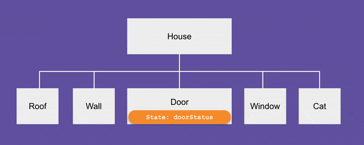
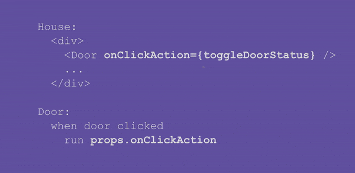

# [译] 深入理解 Props 和 State

> 原文链接: [https://learnreact.design/2018/01/15/props-and-state-re-explained](https://learnreact.design/2018/01/15/props-and-state-re-explained)
>
> 喜欢理由: 文笔生动 通俗易懂

系列博客: 用通俗的语言和涂鸦来解释 React 术语

  * [图解 React](./What-Is-React.md)
  * [图解 React Native](./What-Is-React-Native.md)
  * [组件、Props 和 State](./Components-Props-State.md) 
  * 深入理解 Props 和 State (本文)
  * [React Native vs. Cordova、PhoneGap、Ionic，等等](./React-Native-VS-Cordova-PhoneGap-Ionic-Etc.md)

在[上篇文章](./Components-Props-State.md)中，我们介绍了组件、props 和 state 。

props 和 state 的区别相当明显，确定何时使用 props 和 state 似乎也很简单。举个例子，屋顶的颜色自然就是 prop ，因为颜色是屋顶的固有属性。另一方面，门的开关状态很显然是 state ，因为门在创建后还可以打开或关上。然而在本文中，我们将来挑战这一思维方式！

没开玩笑？！？没错，你所看到的东西既可以是 prop，又可以是 state 。并没有绝对的界限。我将介绍一种更有用、偏实战的方式来思考 prop 和 state 。

## 学习目标

当你读完本文后希望你能重新回到这里，并能够轻松回答以下问题:

  * props 和 state 的主要用途是什么？
  * “state 提升”的含义是什么？在什么场景下需要提升 state ？

## 新成员

你注意到房子周围的新成员了吗？试试点击房门！

查看由 focuser ([@focuser](https://codepen.io/focuser/)) 在 [CodePen](https://codepen.io/) 编写的 Demo : [有猫的 React 小屋](https://codepen.io/focuser/pen/VydPEJ/)。

这是一只嗜睡的猫，门一关她就睡，只有当门再开启的时候才会起来。如果把门关上，她立即又睡过去了。

## 实现猫

现在我来问你，如果实现猫的行为？先来试试吧！

先从下面的“代码”入手，花点时间先读一遍。(再次重申，这并非真正的 JavaScript 代码，它只是以一种简化的形式来帮助你理解概念，同时不会被 JS 中的细节所干扰。)

```jsx
House:
  <div>
    <Roof />
    <Wall />
    <Window />
    <Door />
    <Cat />
  </div>

Door:
  State: status <!-- "open" 或 "closed" -->
  <div>{state.status} door</div>
  当点击门时
    如果 door.state.status 为 "open"
      将 door.state.status 修改成 "closed"
    否则
      将 door.state.status 修改成 "open"
```

在 `House` 组件中又新增了 `Cat` 标签。那么 `Cat` 组件又是怎么样的呢？我们来定义它。

猫要么睡、要么醒。这似乎跟门的开关状态很类似。或许我们同样可以使用 state 来表示猫的状态:

```jsx
Cat:
  State: status <!-- "sleeping" 或 "awake" -->
  <div>{state.status} cat</div>
```

`Cat` 组件定义好后，还需要实现的就只剩下将猫和门的状态进行同步。门的状态为 “open” 时，我们想要猫的状态为 “awake”，反之为 “sleeping” 。

就这么简单？看看再说吧…

### 第一次尝试

既然我们已经有了根据当前状态切换门状态的代码，莫不如我们就在此处切换猫的状态:

```jsx
Door:
  State: status <!-- "open" 或 "closed" -->
  <div>{state.status} door</div>
  当点击门时
    如果 state.status 为 "open"
      将 state.status 修改成 "closed"
      将 cat.state.status 修改成 "sleeping"     <!-- 错误的 -->
    否则
      将 state.status 修改成 "open"
      将 cat.state.status 修改成 "awake"        <!-- 错误的 -->
```

不幸的是，这不起作用！还记得组件的 state 是私有数据吗？只有在组件的内部才能访问。其他组件，无论是父组件还是兄弟组件，都无法访问本组件的 state 。

很遗憾，我们在 `Door` 组件内尝试修改猫的状态以失败告终。(转换成真正的 JavaScript 代码也不例外)

### 第二次尝试

那么在 `Cat` 组件内来修改猫的状态如何？这次应该可以的，是吧？

```jsx
Cat:
  State: status <!-- "sleeping" 或 "awake" -->
  <div>{state.status} cat</div>
  当点击门时                                    <!-- 黑人门号脸？？？怎么个点击法？ -->
    如果 door.state.status 为 "open"            <!-- 错误的 -->
      将 cat.state.status 修改成 "sleeping"
    否则
      将 cat.state.status 修改成 "awake"
```

毫无疑问，在 `Cat` 组件内修改猫的状态是没问题的。但我们需要读取门的状态来决定猫的状态是什么。门的状态是 `Door` 组件的 state ，因此无法在 `Cat` 组件里访问！

### 解决办法

呃！太蹩脚了。要保持门和猫的状态同步，我们必须要在某处能同时访问两者。但看上去数据是通过设计而对外隐藏的。如果来解决此难题呢？

解决办法就是需要我们灵活地理解 state 和 props 的用法。

### 提升门的 state 

`House` 组件:

```jsx
House:
  <div>
    ...
    <Door />
    <Cat />
  </div>
```

`Door` 和 `Cat` 是并排放置的。或许这就是可以轻松同步它们的地方？

但是，我们现在是在 `House` 组件内。与之前的尝试同理，在这里是没办法读取 `Door` 的 state 或者改变 `Cat` 的 state 。

但如果我们使用 props 来替代 state 呢？

```jsx
House:
  <div>
    ...
    <Door status="open" />
    <Cat status="awake" />
  </div>
```

当门关上时:

```jsx
House:
  <div>
    ...
    <Door status="closed" />
    <Cat status="sleeping" />
  </div>
```

当然，门的状态不会是固定的值，它会随时间而改变。我们用 `doorStatus` 来表示门的状态。

```jsx
House:
  <div>
    ...
    <Door status={doorStatus} />
    <Cat status={如果 doorStatus 为 'open' 值为 'awake' 否则为 'sleeping'} />
  </div>
```

这不就解决同步的问题了嘛。顺便问下，这个会变化的值 `doorStatus` 是什么？在组件中什么是可以改变的？没错，正是 state 。

```jsx
House:
  State: doorStatus <!-- 'open' 或 'closed' -->
  <div>
    ...
    <Door status={state.doorStatus} />
    <Cat status={如果 state.doorStatus 为 'open' 值为 'awake' 否则为 'sleeping'} />
  </div>
```

太棒了！`House` 组件现在定义的很好，门和猫的状态也能完美同步。

我们还需要修改 `Door` 和 `Cat` 组件，使用 props 来代替 state :

```jsx
Door:
  <div>{props.status} door</div>
Cat:
  <div>{props.status} cat</div> 
```

正如你所见，因为我们想要使用来父组件的 state，在这种情况下，为了设置猫的状态，门的状态其实是来自于 `House` 的，我们可以将相同的数据表示为父组件的 state，并将数据作为 props 传递给子组件。通常，这被称之为 state 提升。我们将 state 移至组件的更高层级处。



### 更改房子的 state

现在门和猫的状态通过房子的 state 进行连接。如果想开门或唤醒猫的话，我们需要更改 `House` 组件的 state 。

问题来了，哪里是唯一可以更新 `House` 的 state 的地方？就在 `House` 组件内，没错吧？

但是，我们想要在 `Door` 里来触发这次更改。也就是说，我们想要的效果是只有当点击门时才开门，而不是点击整个房子或窗户等。

所以 `Door` 组件需要做些改动:

```jsx
Door:
  <div>{props.status} door</div>
  当点击门时 
    做某件事来修改 `House` 的 state
```

但等等，之前不是说不能在 `Door` 组件内修改 `House` 的 state 吗？

没错。我们没办法直接修改 `House` 的 state 。但并不等于说不能间接地修改。看下面…

在 `House` 组件内，我们来写代码以实际修改它的 state :

```jsx
House:
  State: doorStatus <!-- 'open' 或 'closed' -->
  toggleDoorStatus:
    如果 state.doorStatus 为 'open'
      将 state.doorStatus 修改成 'closed'
    否则
      将 state.doorStatus 修改成 'open'
  ...
```

此刻，我们还未指定何时运行这段代码。我们只是给了它一个名字 (`toggleDoorStatus`)，以便稍后通过名称来找到它运行。

然后将 `toggleDoorStatus` 作为 prop 传递给 `Door` 组件:

```jsx
House:
  ...
  <div>
    ...
    <Door ... onClickAction={toggleDoorStatus} />
    ...
  </div>
```

在 `Door` 组件中，我们只需执行这个点击操作即可:

```jsx
Door:
  <div>{props.status} door</div>
  当点击门时 
    执行 props.onClickAction <!-- 实际运行的是名为 "toggleDoorStatus" 的代码-->
```

这就像把电视遥控器传递给其他人一样。某人在 `Door` 组件内按下了遥控器按键。`House` 组件里的电视机就会换台或加大音量。

将会发生什么取决于传给 `Door` 的遥控器是什么。它可能控制的是房间里的电视、空调或高保真音响系统。在 `Door` 组件内，某人需要做的只是按下遥控器的按键。



这就是我们所需要的！下面是完整“代码”:

```jsx
House:
  State: doorStatus <!-- 'open' or 'closed' -->
  toggleDoorStatus:
    如果 state.doorStatus 为 'open'
      将 state.doorStatus 修改成 'closed'
    否则
      将 state.doorStatus 修改成 'open'
  <div>
    ...
    <Door status={state.doorStatus} onClickAction={toggleDoorStatus} />
    <Cat status={如果 state.doorStatus 为 'open' 值为 'awake' 否则为 'sleeping'} />
  </div>
Door:
  <div>{props.status} door</div>
  当点击门时
    执行 props.onClickAction
Cat:
  <div>{props.status} cat</div>  
```

## 再次审视 Props 和 State

现在让我们重温几个问题，props 和 state 的区别是什么？何时应该使用 state ？何时应该使用 props ？

### 何时使用 state ？ 何时使用 props ？

如果你还记得的话，我曾说过 props 是组件的固有属性，它是不会改变的，而 state 是组件创建后才有的，它是可以改变的。当最初学习这两个概念时，它是有帮助的。

但是，我们刚刚创建的示例让这一观点变得令人困惑。无论是门的开的，还是猫是睡着的，这理所应当应该是 state ，但我们却使用 props 来表示它们。这是为什么？

事实证明，在 state 和 props 的选择问题上，还是有很大的灵活性的。这取决于你看它的视角，你可以采用不同的方式来为组件建模。例如，当门敞开之时，你可以说它是门的状态，你可以说它是房子的状态。

### 一种更有用的理解方式

感到困惑了？这是一种更有用的思考问题的方式：

  * State: 如果 UI 需要更改就表示某处肯定会有 state
  * Props: 用来传递数据、传递控制

当应用运行时，如果 UI 需要变化，那它一定是 state 。当点击门时，门或开或关，那么它一定是某处的 state 。

但是，state 并不一定是更新组件的 state 。它可能位于某个上游组件中。这完全都取决于我们需要在何处以及如何使用这些信息。举个例子，我们决定将门的状态从 `Door` 组件提升到 `House` 组件中，是因为我们需要在 `House` 组件中使用它。

另一方面，props 只是用来向下传递数据的东西。就像我们之前将门的状态从 `House` 组件中向下传递给 `Door` 组件。

props 还可以用来向下传递控制。例如，我们将事件处理方法从 `House` 传给 `Door` 。

### 本示例中的 props 是否会改变值？

并没有，props 永远不会改变值。我懂你的意思，门开开关关，猫睡了又醒。因为我们现在使用 props 来表示它们，很容易让人认为 props 的行为就好比 state，它们的值改变了，是这样吗？

这只是一个错觉，我发现它与翻页书的动画相当相似。


每次房子的 state 发生改变，旧的那只猫就会消失，然后一只崭新状态的猫将重新创建。但是这一过程发生的非常之快，这就造成了我们的视觉残留，认为只有一只猫在那睡了又醒。

翻书中任何页面上的草图都不会移动。类似的，每只猫在其(短暂的)生命中始终保持清醒/沉睡。

## 总结

好了，我们通过一个更复杂的示例再次学习了 props 和 state 。在这个示例中，当点击门时，门需要切换开关状态，同时我们还需要将门和猫的状态保持同步，

因为 state 是私有的，所以我们需要将门的状态从 `Door` 组件提升到 `House` 组件中。这样我们便可以在 `House` 组件中使用此数据来设置门和猫的状态。我们将此数据作为 props 传给 `Door` 和 `Cat`，以便它们根据门的状态来显示正确的图片。

另一个需求是点击门时触发状态的变更。因为现在门的状态是 `House` 的 state，它是私有数据，只能在 `Door` 组件中间接来更改它。我们在 `House` 组件中编写了实际修改 state 的代码，然后将其作为 props 传递给 `Door` 。这类似于把电视的遥控器传给别人。

本文中的示例或许会让你感到一丝困惑。下面是一种用来思考 prop 和 state 的更实用的方式:

  * State: 如果 UI 需要更改就表示某处肯定会有 state
  * Props: 用来传递数据、传递控制

到目前为止感觉如何？如果你有任何问题或意见，请给我留言!
