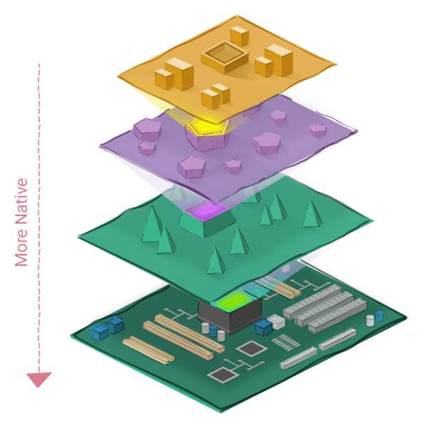
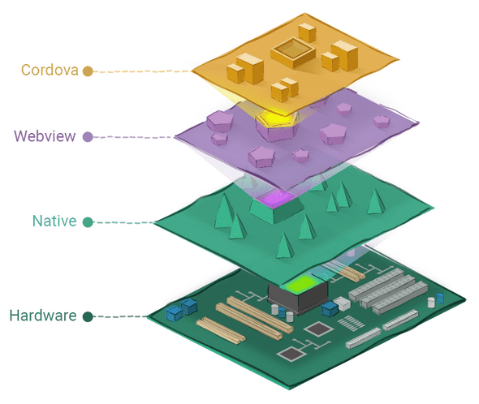
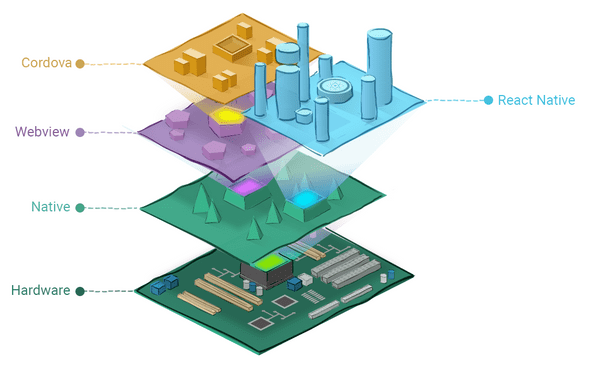

# [译] React Native vs. Cordova、PhoneGap、Ionic，等等

> 原文链接: [https://learnreact.design/2018/02/14/react-native-vs-cordova-phone-gap-ionic-etc](https://learnreact.design/2018/02/14/react-native-vs-cordova-phone-gap-ionic-etc)
>
> 喜欢理由: 文笔生动 通俗易懂

系列博客: 用通俗的语言和涂鸦来解释 React 术语

  * [图解 React](./What-Is-React.md)
  * [图解 React Native](./What-Is-React-Native.md)
  * [组件、Props 和 State](./Components-Props-State.md) 
  * [深入理解 Props 和 State](./Props-And-State-Re-explained.md)
  * React Native vs. Cordova、PhoneGap、Ionic，等等 (本文)

在[前面的文章](./What-Is-React-Native.md)中，我曾说过 React Native 很棒，因为它能让我们使用原生 UI 来开发应用。React Native 应用的用户体验要比使用 WebView UI 的好很多。但是，“原生”的真正含义到底是什么呢？什么是 WebView UI ？什么原生 UI 比 WebView UI 好呢？React Native 相比于其他移动端框架 (比如 PhoneGap、Cordova 和 Ionic) 又如何呢？

现在我们来深入这些问题。坐稳了！(译注: 老司机口头禅)

## 学习目标

当你读完本文后，希望你能重新回到这里，并能够轻松回答以下问题:

  * 什么是原生应用？
  * 什么是 WebView UI ？
  * 更原生化的框架的优势和劣势分别是什么？原生化更少的框架呢？
  * React Native 与 Cordova 相比如何？

## 到底什么才是“原生”应用？

要理解“原生化” (nativeness) 的真正含义，先看下面:

我是黑客帝国 (The Matrix) 的死忠粉，你呢？在影片中，我们所认知的现实实际上是一个模拟世界。有线索提示，即使是锡安，最后一座人类的自由之城，也是模拟出来的。多层模拟现实的想法一直让我为之着迷，一个虚拟世界作为模拟运行在另一个虚拟世界中，而这个虚拟世界又运行在第三个世界中。

这与计算机 (或手机) 的软件架构十分相像。

软件是关于如何操作大量晶体管和电路 (两者统称为硬件) 的指令的集合。直接运行在硬件上的原始指令对我们人类来说是几乎无法理解的, 特别是考虑到当今计算机的复杂性和规模。

要使得软件可以理解和操作的话，计算机科学家将其划分为多个层，这些层均是由框架构成的，每个框架都运行在另一个框架之上。在所有框架中，越接近硬件的框架，我们就说它更“原生”。

所以，一个应用的“原生化”只是一个相对的概念。严格来说，我们无法说一个应用本身是否是原生的。我们只能说，相比于另一个应用，它是更原生的。举个例子，你可以使用 C++ 、Java (或 Kotlin) 或 Cordova 来开发安卓应用。C++ 写的应用是最原生的，而 Cordova 写的应用是最不原生的。Java/Kotlin 写的应用介于两者之间。

## 更原生的应用的好处是什么？

原生化多或少都有各自的好处。接近金属意味着更多的自由，而更多的模拟会让你更为舒适。(求助: metal 是指黑客帝国里的矩阵吗？还是指硬件？)

通常，更原生的框架中的程序能够获取更多的硬件功能，以及使用硬件更加自由。由于在不同语言之间进行模拟和翻译的开销较低，通常它的运行效率更高。但现实是残酷的，它的代码通常更难编写和理解。

另一方面，对于原生化更少的框架来说，通常编写代码更为简单。编码语言也更容易理解和简洁(需要的代码少)。它的词汇更接近与我们人类的自然语言。它不需要我们十分了解硬件的构成以及它在幕后的工作方式。还有一个额外的好处，原生化较少的框架中的程序通常更具可移植性，程序可以在完全不同的硬件平台上运行而无需修改，因为它的词汇和底层概念不包含任何特定于原始硬件的内容。但是，这一切便利的代码就是通常会牺牲一些效率和自由度。

## 移动端框架阵营

在 React Native 出现之前，移动端框架一般分为两个阵营。

首先是原生阵营，例如安卓的 Java/Kotlin 和 IOS 的 Objective-C/Swift 。此阵营中的应用速度都很快，并且可以使用丰富的硬件功能。用户界面是针对目标平台(安卓或 IOS)的定制的，因此使用起来是流畅且愉悦的。但是，所有这些好处都被限制在一个平台上了。要开发应用的话，需要学习不同的框架，这使得学习成本翻倍，甚至更高，在这点上远高于其他数百万的 Web 开发人员。

另外一个阵营就是以 Cordova/PhoneGap 和 Ionic 为代表的。这些框架可以让 Web 开发人员使用他们已经具备的 HTML、CSS 和 JavaScript 技能来开发应用。这些应用可以同时运行在安卓和 IOS 平台上(还可以有更多平台)。但是，相比于原生应用，这类应用会没有那么流畅，能访问的硬件功能也有限。最重要的是，这些应用的用户界面太烂了！因为这些框架使用的 WebView 来渲染 UI，所以我们将其称之为 WebView
 框架。

WebView 框架是在原生框架之上构建的。我们可以将前者视为运行在后者内部的模拟世界中。这正是他们有上述的好处和限制的原因所在。

为什么我们不能集两者之优势，同时又避免它们的不足呢？这正是 React Native 要做的事。

React Native 代表的是移动端框架的第三阵营。它的 UI 层要比 WebView 框架更原生，而其余部分处于模拟层，以实现其易用性。

## React Native 要比 WebView UI 原生得多

像 Cordova 这样的框架可以使用 Web 技术来开发移动 UI 。它们是如何做到的呢？它们在每个应用中都内嵌了 Web 浏览器，并美名其曰 WebView！你在 UI 中看到的所有，包括按钮、菜单和动画，都是在浏览器的网页中运行的。以模拟的角度来看，Cordova 应用的 UI 就是运行在 Web 浏览器中的模拟世界，而浏览器又是运行在原生框架里的另一个模拟世界。

相比之下，React Native 的 UI 要比 WebView 框架低一个层级，它直接运行在原生框架里。

这种架构奠定了 React Native UI 的优势。React Native 直接使用了原生 UI 组件，而 WebView 框架是使用 HTML/CSS 的 Web UI 来模拟原生 UI 。真和假，你更喜欢哪个？

根据经验，识别出一个应用是否是使用 WebView 框架开发的并不难。通过一些小测试，比如滚动加速、键盘操作、导航和 UI 的流畅性。如果这些操作达不到原生般的效果，那么累积后的效果将导致糟糕的用户体验。

## React Native 使用 JavaScript 来让开发变得简单

另一方面，React Native 还可以让我们使用 JavaScript 来编写应用，同时使用类似于 HTML 和 CSS 的语法来开发 UI 。这无疑降低了 Web 设计师和开发人员的门槛。

当需要时，React Native 还提供了一种渗透到原生框架的方法，以实现我们希望在应用中实现的任何原生功能。这有点像在黑客帝国中打电话。

## 所以 WebView 框架一无是处喽？

不，当然不是。举个例子，如果你已经有了 Web 应用，并且想尽快地发布到应用商店中。您愿意牺牲用户体验以缩短面向用户的时间。

另一种情况是，如果你的应用中并没有太多交互相关的东西，那么把它放入 WebView 中也并没那么糟。

但是，如果应用的用户体验重要的话，如果应用具有一定的交互性的话，像接受用户输入、拖拽、滑动页面等，那么决定应该考虑使用 React Native 。因为使用 WebView UI 来模拟原生 UI 是下下策。

## 总结

好了，我们已经介绍了“原生”的真正含义、什么是 WebView UI 、为什么 React Native UI 更好，以及 React Native 相比于像 Cordova/PhoneGap 和 Ionic 这样的 WebView 框架如何。

你怎么认为？你会使用哪种框架来开发你的下一个应用？

