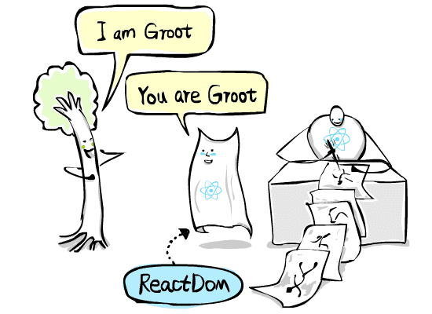
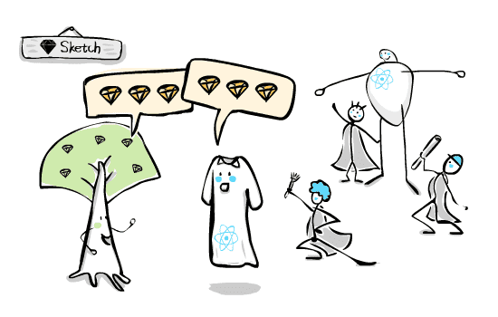

# [译] 图解 React Native

> 原文链接: [https://learnreact.design/2017/06/20/what-is-react-native](https://learnreact.design/2017/06/20/what-is-react-native)
>
> 喜欢理由: 插图大爱 生动有趣 视角独到

系列博客: 用通俗的语言和涂鸦来解释 React 术语

  * [图解 React](./What-Is-React.md)
  * 图解 React Native (本文)
  * [组件、Props 和 State](./Components-Props-State.md)
  * [深入理解 Props 和 State](https://learnreact.design/2018/01/15/props-and-state-re-explained) (待翻译)
  * [React Native vs. Cordova、PhoneGap、Ionic，等等](https://learnreact.design/2018/02/14/react-native-vs-cordova-phone-gap-ionic-etc) (待翻译)

在[上一篇文章](./What-Is-React.md)中，我们介绍了什么是 React 以及是什么使得它如此特别。今天我们将介绍 React Native: 它是做什么的，它出自何处，它和 React 有哪些不同之处，以及它为何如此令人振奋。

## 学习目标

当你读完本文后，希望你能重新回到这里，并能够轻松回答以下问题:

  * 什么是 React Native ？为什么它的名字中有 “Native” 字样？
  * 为什么 React Native 如此之酷？
  * 我们可以分别使用 React Native 和 React 来开发什么？
  * 为什么会出现 ReactDOM ？它是做什么的？
  * React 渲染器 ( renderer )是用来做什么的？
  * React Sketch.app 工作原理是什么？
  * ReactVR 的工作原理是什么？
  * 什么是 ReactJS ？React.js 又是什么？

## 不仅仅是 Web

学完上一篇文章的你现在脑海中的画面应该是这样的:


你也知道，React 是在 Web 上开发用户界面的利器。使用 React 来开发 UI 的话，就能够描述你想要什么，而不是告诉 UI 如何更新 (响应式 UI)，还可以在可重用组件中组织代码，并创建高性能用户界面，而无需担心DOM超慢的速度 (虚拟 DOM)。越来越多的开发者选择 React 是因为它可以使得开发者更专注于上层业务，而不是底层 DOM 更新的细节。我们将这种开发 UI 的方式称之为 React 范式。范式基本上就是你思考一个问题的方式，以及这个问题的描述方式和解决方案。

对于 Web 应用来说这无疑很棒。那对于其他平台呢，比如 iOS 和 安卓？如果能将 React 范式应用于原生应用的开发，岂不是很棒？

在某种程度上来说，移动端的工作方式与 Web 端是相同的。比方说，有一个模特(树人)，还有一个根据模特来创建视觉元素的艺术家。没什么可惊讶的，构建原生应用 UI 的传统方式就是直接操纵树人并告诉他如何更新(直接跟树人交谈)。这与在 Web 浏览器中直接操纵 DOM 有类似的缺点。React 绝对有助于解决此类问题。

除了相似之处外，移动端还有与 Web 端不同的地方，不同系统之间都是完全不同的。在过去，要开发原生应用的话，开发者需要学习特定的语言和平台工具链。

这有点像在国外的工作室上班，员工需要说不同的语言。你需要精通所有语言才能跟所有模特进行交流。这听上去就很麻烦，你说是吧？


所以，如果想要你开发出的原生应用能运行在 iOS 和安卓两个平台上的话，你需要创建两套完全分离的代码库，同样的业务逻辑需要写两遍。开发应用既困难、成本又高，从长期的维护来看的话更是如此。

这正是 React Native 诞生的原因。我们来一起看看它是如何将开发过程大大简化的。

## React Native

### 渲染器 ( renderer ) 和全新的 React

对于 Web 应用来说，React 负责启用 React 范式 (管理响应式 UI、组件和虚拟 DOM)，以及实际更新浏览器中的 DOM (与 Domo 交流)。当 DOM 是唯一需要交互的对象时，React 可以轻松处理好这两项任务。

但是，对于原生应用的话，当需要管理不同平台上的各种“树人”时，事情就变得有挑战了。如果我们将更多的重担压在 React 肩上的话，那我们可怜的超级英雄将会为此抓狂。


为了解决此问题，React 创建者们将原来的 React 拆分成两部分。第一部分是全新的 React ，它只负责启用 React 范式。第二部分叫做 ReactDOM ，它唯一的任务就是与浏览器中的 DOM 进行交互。因为 ReactDOM 负责更新 DOM ，而 DOM 又决定了浏览器渲染的内容，所以我们将 ReactDOM 称之为渲染器。

想象一下，我们的超级英雄脱下了他的斗篷，并在上面洒了一些魔法之尘。


斗篷立刻就有了生命，并成为了超级英雄的小助手。从负责与 Domo 沟通的枷锁中释放后，React 现在可以专注于做他最擅长的事。



这种角色分离的理念非常之强大。现在我们只需要维护一个共享的核心库，同时编写全新的渲染器来适应新平台。这种方式要比之前简单多了。由于有了 iOS 和安卓渲染器的强力支撑，现在你可以**只使用一种语言和相同的 React 范式**来同时为两个平台开发应用。


React 只需要专注于他擅长的领域即可。渲染器来负责沟通。

### 一个完整的平台

React 的官网定义是: 用来开发用户界面的 JavaScript 库。它的含义有两层: 首先它是 UI 开发的利器，其次它不涉及除UI开发以外的任何其他领域。

实际上，**你无法单独使用 React 开发出一个完整的应用**。例如，你需要 CSS 来写外观样式，你需要 webpack 来打包，你需要 Firebase 来做数据持久化，等等。


“网络浏览器” 工作室里的实际景象要你比之前所见到的要忙碌得多。

这在 Web 开发环境下还好，因为 React 是一个 JavaScript 库，所以它能自然地适应 Web 环境下的其他部件。这些部件要么本身就是 JavaScript 库，要么能很容易地与 JavaScript 适配。毕竟 JavaScript 是 Web 上的标准语言。

但是，对于移动端来说就比较困难了，因为那里需要支持多种语言和技术。这个时候，我们就需要包含一整套部件，而且这些部件的使用方法要跟 React 类似，至少是能用 JavaScript 来调用。这样，React Native 诞生了。

相比于 Web 上的 React ，React Native 包括更多东西:

  * 全新的 React 作为核心库 (我们的超级英雄，只不过没穿斗篷)
  * iOS 和安卓的渲染器
  * 将代码转换成可安装应用的工具
  * 原生 UI 组件 (状态栏、列表等等)和动画
  * UI 的样式和布局工具箱 (flexbox)
  * 构建大多数应用的基础部分 (比如网络)
  * 提供原生功能的部分，比如粘贴板、加速计和存储
  * ...

我们说 React Native 本身是一个完整的平台是因为**它包含开发完整应用所需的一切**。相比之下，原本的 React 只负责 Web UI ，你需要去自己引用其他部分才能创建出一个 Web 应用。


React Native 的组成

### 原生 UI

为什么 React Native 的名字里有 Native 字样？这实际上是它的标志性特征: React Native 的内置 UI 是由**原生 UI 组件**组成的，这些组件表现良好，外观/感觉一致，并非 WebView 中所包含的一些垃圾模拟。用 React Native 开发的应用与用像 Swift 和 Java 开发的原生应用放在一起，通常是难以区分的。

你也知道，像滚动加速、动画、键盘行为和阴影这些细节，实际上在应用程序的用户体验中扮演了非常重要的角色。如果这些东西不能与你手机中其他应用保持统一的话，那么用户很快就会觉得不爽。

我原本的目的就是想在这里解释清楚 “native” 的真正含义以及为何 React Native 的性能更好。但我发现在几次头脑风暴之后，我的一整页笔记很快就写满了。还是在后面的文章中再来单独讲它吧。

到目前为止，我只需要你记住原生 UI 是让 React Native 大放异彩的原因之一。

看到这里，你应该了解到 React Native 是一个完整的平台，它可以让你使用 JavaScript 来开发真正的原生应用，而且还是用 React 的路子来写（React 范式）。


## React Sketch.app、ReactVR、React XYZ…

 Airbnb 最近发布了一款十分有趣的工具，叫做 [React Sketch.app](https://airbnb.design/painting-with-code/) ，它可以将 React 代码转换成 Sketch 里的图层。你能猜出它的工作原理吗？

没错！从本质上来说，它就是使用了特殊渲染器的 React Native ，这个渲染器能与 Sketch 中的树人进行交流！



因为 React Sketch.app 是基于 React Native 的，它也是一个完整的平台，所以可以直接使用它来从远程 API 来获取数据并在 Sketch 中进行渲染。

与此同时，许多 React Native 的其他变种纷纷问世，用来支持在 [Windows](https://github.com/Microsoft/react-native-windows)、 [macOS](https://github.com/ptmt/react-native-macos)、[VR](https://github.com/facebook/react-360) 等平台上创建应用。

这意味着只要你掌握了 React ，就可以在大量的平台上使用 JavaScript 来创建应用，而且对新平台的支持还在不断涌现。不同的平台，同样的思维模式。正如 React Native 的创建者们所倡导的: “**一次学习，随处编写**”。

## 动手时刻！

说了这么多！你是否想在自己的手机上也尝试一番？

我也很兴奋！拿起你的手机跟我一起动起来！

  1. 在手机上下载 Expo 应用。你可以点击这里下载: [iOS](https://itunes.apple.com/app/apple-store/id982107779?mt=8)、[安卓](https://play.google.com/store/apps/details?id=host.exp.exponent)，或者在 App Store 中搜索 “Expo” 。
  1. 在电脑上打开网页: [https://snack.expo.io/](https://snack.expo.io/) 。
  1. 在手机上启动 Expo 应用并点击 “Scan QR Code” 。
  1. 扫描电脑上显示的二维码。如果一些正常，你应该可以看见一条绿色的信息 “Device connected” 。
  1. 如果二维码无法自动消失的话，可以点击页面右上角的小叉关闭。关闭后应该可以看见代码编辑器。
  1. 删除编辑器中的所有代码，然后将[此代码](https://gist.githubusercontent.com/lintonye/5cb3c11349591bf475b91573682fe688/raw/4ea0d4562ce45c1ba3867a1759359e1f86bb590a/domohat.jsx)粘贴进去。
  1. 你在手机上看到了什么？
  1. 你可以随意更改编辑器中的代码，然后立即在手机中查看结果！

在后面的文章中我会对开发环境进行详细地解释。你暂时只需记住它就是 React Native 的 Codepen (在上篇文章中我曾使用它来展示示例 Domo 的帽子)。

如果你将 [React Native 版本](https://gist.github.com/lintonye/5cb3c11349591bf475b91573682fe688) 和 [React (Web) 版本](https://codepen.io/focuser/pen/gROrXx)进行对比的话，你会发现它们的代码十分相似，都是这样的:

```js
const Hat = ...

const Thinker = ...

// 下面的代码是 React Native 版本的
// Web 版本的话，只需将 “View” 替换成 “div”
const ThinkerWithHat = ({hat}) => (
  <View>
    <Thinker />
    <Hat type={hat}/>
  </View>
);

const HatSwitcher = ...

...
```

“一次学习，随处编写”！还记得吗？

## 什么是 ReactJS ？什么是 React.js ？

你可能无数次地听到 ReactJS (或 React.js) ，我也是这么叫的。实际上这并非官方名称。自从[诞生之日](https://web.archive.org/web/20130529213355/https://facebook.github.io/react/)起，官方名称一直都是 “React” ，从未改过。

因为一般 JavaScript 库的名字都趋向于叫 “XyzJS” 或 “Xyz.js” ，React 也不例外，或许开发者们都已经习惯给库的名称加上 “JS" 或 “.js” 的后缀了。因为 React 最开始是作为 Web 库的身份出现的，所以很多开发者都习惯于实用 ReactJS 或 React.js 来泛指 Web 上的 React ，即 React 和 ReactDOM 的集合。

按照惯例，当我提到 ReactJS 时，其实我想表达的也是 Web 上的 React 。

## 总结

好了，到目前为止，我们已经介绍了不少内容。我们了解了一些 React 的历史以及 React Native 的组成。作为一个完整的平台，React Native 包含开发原生应用所需的一切，并且它使用的是 JavaScript 语言和 React 范式。React Native 现在支持多个平台，其中包括 iOS、Android、Windows、macOS、Sketch.app ，甚至还有 VR 。“一次学习，随处编写”！

在下篇文章中，我们将介绍什么是真正的原生应用，以及为何 React Native 是开发原生应用的最佳方式之一。

我鼓励你回到[学习目标](#学习目标)那里，去试试自己是否能够回答出全部问题。如果你有任何问题或意见，请给我留言!
